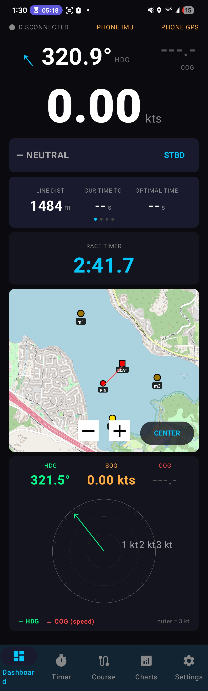
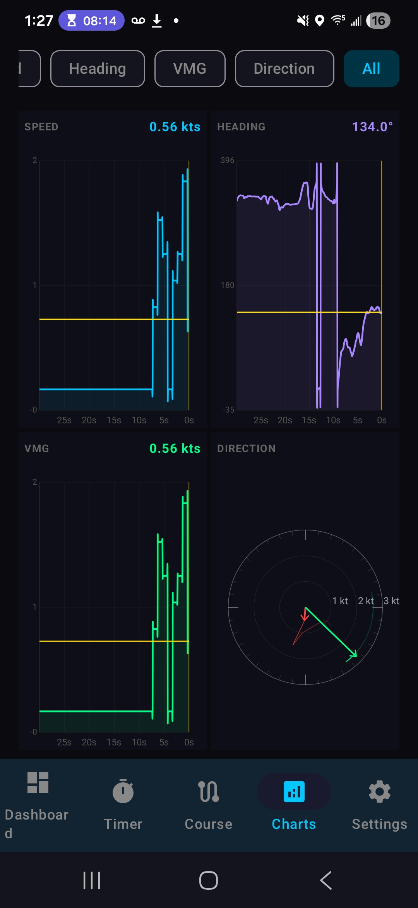

# TomsSailboatRacingDashboards

A two‑part sailing instrumentation system to give sailors fast, accurate, race‑useful data such as historical speed and heading on a budget. The system consists of:

1. **A mobile app** (Android) that displays sailing metrics. I dont own an iphone and you need to pay a recurring fee to get something on the apple app store. 
2. **An external hardware sensor module** built around a Teensy 4.0, u‑blox M9N GPS, and BNO080 IMU for high‑rate, high‑accuracy data.

The app can run **stand‑alone** using the phone’s internal sensors, but accuracy is limited by the phone’s slow refresh rate. The full system shines when paired with the external hardware module. You can use a cheaper GPS module and probably get all parts for under $100 assuming you already own an android phone.

### Primary dashboard


### Sample of possible graphs


---

## Why This Project Exists

Most phones only provide:
- 1 Hz GPS updates
- Low‑accuracy heading
- crappy apps you pay $20 for (this is free)

---

## Component 1: The Mobile App

The app contains:
- Current speed (knots)
- Heading
- Course over ground (COG)
- Historical speed graph
- Manual or auto count down timer with narration
- Lift/header visualization (WIP)
- Data logging

### App Data Sources
| Source | Update Rate | Notes |
|--------|-------------|-------|
| **Phone GPS** | ~1 Hz | Low accuracy, large latency, not suitable for racing |
| **External Module** | 25 Hz | High‑rate, low‑latency, race‑grade data |

The app automatically switches to high‑rate mode when the external module is connected via Bluetooth.

---

## Component 2: External Hardware Module

### Hardware Used
- **Teensy 4.0** (600 MHz MCU)
- **Bluetooth Classic (HC‑05)** for Android streaming
- **u‑blox M9N GPS** (SparkFun GPS‑15712 or equivalent). 
  - 32db High Gain Cirocomm 5cm Active GPS Antenna Ceramic Antenna
- **IMU** (BNO080)
- **5V power supply** (battery or USB breakout board)
- solder in breadboard - for permanently mounting
- tupperware to protect electronics
- Optional: 3d printed enclosure, this is custom designed but is useful to orient + protect the board inside the protective case if the case is secured to the boat and we want to true up the heading based on the IMU. TODO is upload the stl
- power bank
- Optional: **sunlight‑readable display** for standalone mode

### Why This Hardware?
- **M9N GPS**  
  - 25 Hz update rate  
  - Excellent multipath rejection  
  - Fast reacquisition  
  - High‑resolution speed output 
- u.fl antenna - You can generally pick one of either an onboard antenna, u.fl, or external SMA puck style antenna (this is in order from smallest to biggest). The antenna I chose is a good mix of size and performance and should fit inside

- **IMU (BNO080)**  
  - Tilt‑compensated heading  
  - Fast response during maneuvers  

- **Teensy 4.0**  
  - Extremely fast UBX parsing  
  - Plenty of headroom for sensor fusion  
  - Low latency  
  - I had one available - an ESP32 actually has a bluetooth module and may be cheaper/fast enough.

- **HC‑05 bluetooth module**  
  - Has bluetooth classic (as opposed to LE), this helps with the continuous stream of packets and i think in practical applications is good enough for our scenario
  - ~100–200 kbps sustained
  - 5–10 ms latency*


- **Android phone**
  - It is very hard to find a cheap display that can be visible outdoors in sunlight. Most people own a phone with a good display so let's leverage that. Also it's easier to build an app and have the ability to interact with it via your touchscreen.

---

## GPS Accuracy & Speed Resolution

### Phone GPS
- **1 Hz**
- Speed resolution: ~0.1–0.2 knots
- Large latency (0.5–1.5 seconds)
- Heading unreliable below ~2–3 knots

### M9N GPS
- **25 Hz**
- Speed resolution:  
  - u‑blox reports speed with **0.01 m/s resolution**  
  - Converted to knots:  
    

\[
    0.01\ \text{m/s} \approx 0.0194\ \text{knots}
    \]


- Practical accuracy: **±0.05 knots**
- Heading usable down to ~0.5 knots when fused with IMU

This is why the external module feels almost instant compared to a phone.

---

## Data Transmission

### External Module → Phone
Communication uses **Bluetooth Classic (HC‑05)** for low latency and high throughput.

### Packet Format (example)

Without GPS:  
```
"$SAL,hdg,pitch,roll,gyroZ,ax,ay,az,imuAcc*CRC\r\n"  
(“Without GPS:  $SAL,hdg,pitch,roll,gyroZ,ax,ay,az,imuAccXX”)*
```

With GPS:  
```
"$SAL,hdg,pitch,roll,gyroZ,ax,ay,az,imuAcc,lat,lon,sog,cog,fix*CRC\r\n"  
(“With GPS:  $SAL,...,lat,lon,sog,cog,fixXX”)*
```

| Field | Meaning |
| --- | --- |
| ``hdg`` | Magnetic heading (deg true, 0–360) |
| ``pitch`` | Pitch angle (deg) |
| ``roll`` | Roll angle (deg) |
| ``gyroZ`` | Yaw rate (°/s) |
| ``ax`` | Linear accel X (m/s²) |
| ``ay`` | Linear accel Y (m/s²) |
| ``az`` | Linear accel Z (m/s²) |
| ``imuAcc`` | IMU accuracy (0–3) |

GPS‑augmented packet fields
`"SAL, ... ,%.6f,%.6f,%.2f,%.1f,%u"`
| Field | Meaning |
| --- | --- |
| ``lat`` | Latitude (deg, 6 decimals) |
| ``lon`` | Longitude (deg, 6 decimals) |
| ``sog_kts`` | Speed over ground (knots) |
| ``cog`` | Course over ground (deg true) |
| ``fixType`` | 0=none, 2=2D, 3=3D |

The packet rate is driven by the IMU:

```
“40 ms = 25 Hz”
(“enableARVRStabilizedRotationVector(40);  // 40 ms = 25 Hz”)
```

When GPS is active, GPS fixes trigger transmission instead.

---
### Wiring
You can look at the GpsAndImuDataEmitterOverBluetooth which has the most recent wiring. It all text, a TODO is to diagram this into the readme. 